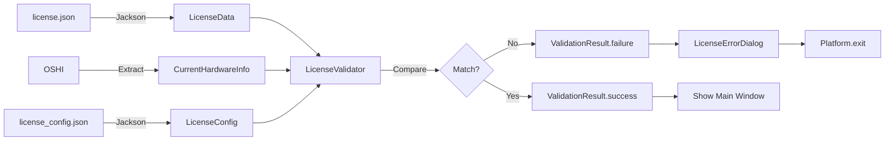

# Data Model: License Verification

**Feature**: 001-license-verification  
**Date**: 2026-01-28  
**Purpose**: Define data structures for license validation system

## Core Entities

### 1. LicenseData

Represents the parsed content of an encrypted license key file.

**Attributes**:
- `version: String` - Schema version (e.g., "1.0") for backward compatibility
- `encryptedData: String` - Base64-encoded AES-256 encrypted payload (contains deviceId + expiry)
- `signature: String` - Base64-encoded HMAC-SHA256 signature

**Validation Rules**:
- `version` MUST match supported schema versions (currently "1.0")
- `encryptedData` MUST be valid Base64 string
- `signature` MUST be valid Base64 string
- HMAC signature MUST be verified before attempting decryption

**Example JSON** (actual license file):
```json
{
  "v": "1.0",
  "d": "rO0ABXNyABNqYXZhLnV0aWwuQXJyYXlMaXN0eIHSHZnHYZ0DAAFJAARzaXpleHAAAAACdwQAAAAC...",
  "s": "dGhpcyBpcyBhIGJhc2U2NCBlbmNvZGVkIEhNQUM="
}
```

**Encrypted Payload Contents** (decrypted internally):
```
deviceId|expiryTimestamp

Example: "j8h3k2l9m4n5p7q1r6s0t2u8v3w9x1y4z5a7b2c3d6e8="|1735689599000
```

**Security Note**: Users cannot see what's inside the license file; all sensitive data is encrypted.

---

### 2. DeviceId (Internal Concept)

A SHA-256 hash that uniquely identifies a hardware configuration.

**Purpose**: Abstract away specific hardware details into a single identifier

**Computation**:
```java
String macsSorted = macAddresses.stream()
    .sorted()
    .collect(Collectors.joining("|"));
String deviceData = macsSorted + "|" + motherboardSerial;

MessageDigest digest = MessageDigest.getInstance("SHA-256");
byte[] deviceIdBytes = digest.digest(deviceData.getBytes(StandardCharsets.UTF_8));
String deviceId = Base64.getEncoder().encodeToString(deviceIdBytes);
```

**Example**:
```
Input:
  MACs: ["00:1A:2B:3C:4D:5E", "AA:BB:CC:DD:EE:FF"]
  Serial: "ABC123456789"
  
deviceData = "00:1A:2B:3C:4D:5E|AA:BB:CC:DD:EE:FF|ABC123456789"
deviceId = "j8h3k2l9m4n5p7q1r6s0t2u8v3w9x1y4z5a7b2c3d6e8=" (Base64 of SHA-256 hash)
```

**Why Use DeviceId?**
- Obfuscates hardware details (users can't reverse-engineer MAC or serial from hash)
- Consistent comparison (always same length, format-independent)
- Supports multiple MAC addresses seamlessly (sorted to ensure deterministic hashing)

---

### 3. ValidationResult

Represents the outcome of license validation.

**Attributes**:
- `isValid: boolean` - Whether license validation passed
- `errorCode: ErrorCode` - Reason for failure (if invalid)
- `errorMessage: String` - Human-readable error message

**Enum: ErrorCode**:
```java
public enum ErrorCode {
    SUCCESS,              // Validation passed
    FILE_NOT_FOUND,       // License file missing
    INVALID_FORMAT,       // JSON parsing failed
    SIGNATURE_MISMATCH,   // HMAC validation failed
    DECRYPTION_FAILED,    // AES decryption failed
    HARDWARE_MISMATCH,    // DeviceId doesn't match current hardware
    LICENSE_EXPIRED,      // Current date > expiry timestamp
    UNSUPPORTED_VERSION   // Schema version not recognized
}
```

**Factory Methods**:
```java
ValidationResult success() 
    → isValid=true, errorCode=SUCCESS

ValidationResult failure(ErrorCode code, String message)
    → isValid=false, errorCode=code, errorMessage=message
```

---

### 4. LicenseConfig

Represents external configuration for license system behavior.

**Attributes**:
- `enabled: boolean` - Whether license checking is active (default: true)
- `errorMessage: String` - Custom error message for failed validation
- `logoPath: String` - Path to company logo image for error dialog
- `licenseFilePath: String` - Path to license key file (default: "./license.json")

**Validation Rules**:
- If `enabled` is false, validation is bypassed (for development builds)
- `errorMessage` defaults to "Kindly contact Mitutoyo for more details."
- `logoPath` can be null (no logo displayed)
- `licenseFilePath` defaults to current directory

**Example JSON** (`license_config.json`):
```json
{
  "enabled": true,
  "errorMessage": "Kindly contact Mitutoyo for more details.",
  "logoPath": "resources/mitutoyo_logo.png",
  "licenseFilePath": "./license.json"
}
```

---

### 5. CurrentHardwareInfo

Represents hardware information extracted from the running system.

**Attributes**:
- `macAddresses: List<String>` - All MAC addresses from active network interfaces
- `motherboardSerial: String` - Motherboard serial number from OSHI

**Source**: OSHI library (SystemInfo → Hardware → NetworkIF / ComputerSystem)

**Extraction Logic**:
- Filter out loopback and virtual adapters
- Include only physical network interfaces with non-empty MAC addresses

---

## Data Flow Diagram



---

## Persistence Strategy

| Entity | Storage | Format | Location |
|--------|---------|--------|----------|
| `LicenseData` | External file | JSON | `./license.json` (configurable) |
| `LicenseConfig` | External file | JSON | `./license_config.json` |
| `CurrentHardwareInfo` | Runtime only | N/A | Extracted each startup |
| `ValidationResult` | Runtime only | N/A | Discarded after validation |

---

## Security Considerations

1. **No sensitive data logging**: Hardware identifiers MUST NOT be logged
2. **HMAC secret protection**: Embedded secret key should be obfuscated (ProGuard recommended)
3. **Signature validation**: Use constant-time comparison (`MessageDigest.isEqual()`)
4. **File path validation**: Prevent directory traversal attacks when loading license file

---

## Why Use HardwareInfo?

**Technical Rationale**: Separating hardware information into its own POJO enables:
- **Reusability**: Used in both `LicenseData` (from file) and `CurrentHardwareInfo` (from system)
- **Testability**: Easy to mock for unit tests
- **Validation**: Centralize MAC format and serial number validation logic
- **Future extensibility**: Add CPU ID, disk serial, etc. without changing other models
