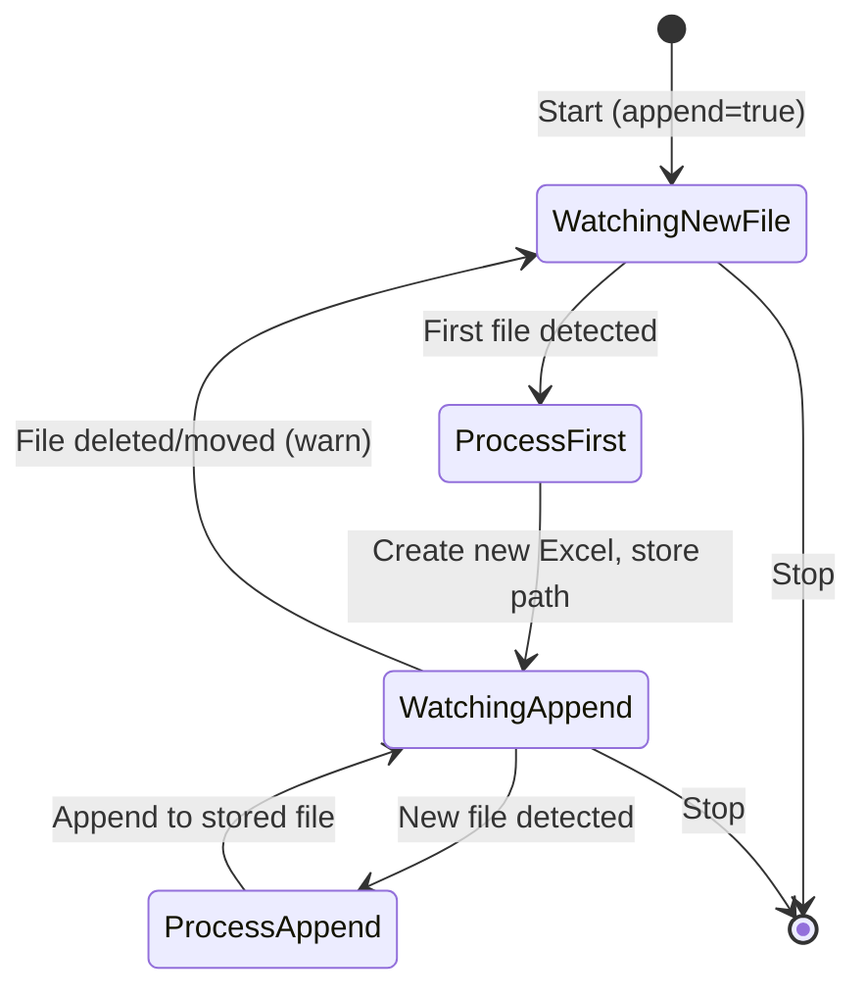

# Data Model: Excel Append Mode

**Feature**: 002-excel-append-mode
**Date**: 2026-01-29

## Extended Entities

### RunningModeConfig (Extend Existing)

**Location**: `src/main/java/com/example/smarttemplatefiller/RunningModeConfig.java`

**New Fields**:
| Field | Type | Default | Description |
|-------|------|---------|-------------|
| `appendModeEnabled` | boolean | false | Whether run mode uses append behavior |
| `lastGeneratedFilePath` | String (transient) | null | Path to last generated file (not persisted) |

```java
// New fields to add
private boolean appendModeEnabled = false;

@JsonIgnore
private transient String lastGeneratedFilePath;
```

---

### ExportConfiguration (New Class)

**Location**: `src/main/java/com/example/smarttemplatefiller/ExportConfiguration.java`

**Purpose**: Holds export settings for manual export dialog.

| Field | Type | Description |
|-------|------|-------------|
| `appendMode` | boolean | Whether to append to existing file |
| `appendTargetPath` | String | Path to existing file for append |

---

### AppendResult (New Class)

**Location**: `src/main/java/com/example/smarttemplatefiller/AppendResult.java`

**Purpose**: Return value from append operations with details.

| Field | Type | Description |
|-------|------|-------------|
| `success` | boolean | Whether append succeeded |
| `rowsAdded` | int | Number of data rows added |
| `rowOffset` | int | Offset applied to target cells |
| `targetFilePath` | String | Path to target file |
| `warnings` | List<String> | Any warnings (row limit, etc.) |
| `errorMessage` | String | Error message if failed |

---

## Method Signatures

### ExcelWriter (Extend Existing)

**New Method**:
```java
/**
 * Append data from source file to existing Excel file using mapping.
 * Calculates row offset from last occupied row.
 * 
 * @param txtFile Source text file
 * @param mappingFile Mapping JSON file
 * @param existingExcelFile Target Excel file to append to
 * @return AppendResult with operation details
 */
public static AppendResult appendToMappedFile(
    File txtFile, 
    File mappingFile, 
    File existingExcelFile
)
```

**Helper Method**:
```java
/**
 * Calculate row offset from existing Excel file.
 * Returns 0 if file is empty.
 */
private static int calculateRowOffset(Sheet sheet)
```

---

## State Diagram: Run Mode Append



---

## Configuration JSON Schema Update

**File**: `~/.smarttemplatefiller/running_mode_config.json`

```json
{
  "mappingFile": "/path/to/mapping.json",
  "watchFolder": "/path/to/watch",
  "outputFolder": "/path/to/output",
  "filePattern": "*.txt,*.asc",
  "intervalSeconds": 1,
  "appendModeEnabled": false
}
```

Note: `lastGeneratedFilePath` is NOT persisted (transient) - it only lives during run mode session.
